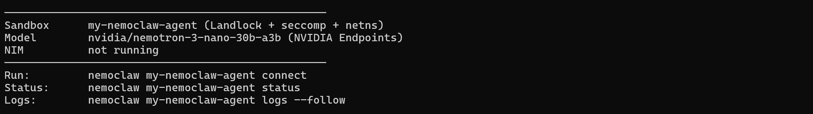

# NemoClaw: AI agent deployment on Azure Kubernetes Services (AKS)

This repo demonstrates the deployment of **NVIDIA NemoClaw** (sandboxed, policy-controlled AI agent runtime) to **Azure Kubernetes Service (AKS)**. A pre-built companion Docker image contains the base orchestration stack (NemoClaw CLI, OpenShell, access policies) and hosted on **GitHub Container Registry (GHCR)**.

> [!NOTE]
> This implementation delivers *remote* AI inference, i.e. `Nemotron 3 Nano 30B` model is consumed remotely from [NVIDIA's cloud](integrate.api.nvidia.com). Prompts are dynamically routed through the OpenShell gateway using your NVIDIA cloud's API key, managed by Kubernetes secrets.

## 📑 Table of Contents
- [Part 1: Prerequisites](#part-1-prerequisites)
- [Part 2: Environment Setup](#part-2-environment-setup)
- [Part 3: AKS Deployment](#part-3-aks-deployment)
- [Part 4: Testing the Agent](#part-4-testing-the-agent)
- [Part 5: Cleanup](#part-5-cleanup)

## Part 1: Prerequisites
You need to install [Azure CLI](..........), Kubernetes CLI - [kubectl](............) and [Git CLI](.............) on your local machine. Verify their presencse with the relevant commands below:

``` PowerShell
az version
kubectl version --client
git --version
```

You will also need:

| Requirement         | Format                                                                    |
| ------------------- | ------------------------------------------------------------------------- |
| Azure subscription  | Authorised Contributor access to [Azure portal](https://portal.azure.com) |
| NVIDIA API key      | String value that starts with `nvapi-`                                    |

> [!TIP]
> The NVIDIA API key is required for remote authentication to NVIDIA's cloud and consumption of hosted AI model. You can generate your free API key on this [Web page](https://build.nvidia.com/settings/api-keys).

## Part 2: Environment Setup

### 2.1 Get NemoClaw Blueprint Files
You only need the `nemoclaw-blueprint/` subfolder from the official NVIDIA repo. Download the latest version of NemoClaw package from the following GitHub repo, copy nemoclaw-blueprint directory and delete the rest:

``` PowerShell
git clone https://github.com/NVIDIA/NemoClaw.git
```

### 2.2 Prepare Deployment Files
Download provided `nemoclaw-blueprint` from this repo. Your working directory should look like this:

``` JSON
<YOUR_INSTALLATION_DIRECTORY>\
├── nemoclaw-deployment.yaml
└── nemoclaw-blueprint\
    └── policies\
        ├── openclaw-sandbox.yaml
        └── presets\
```

### 2.3 Edit the Deployment YAML
Open `nemoclaw-deployment.yaml` and replace the following **placeholder** field value:

| Placeholder             | Replace with                                     |
| ----------------------- | ------------------------------------------------ |
| `<YOUR_NVIDIA_API_KEY>` | Your key from build.nvidia.com (starts `nvapi-`) |

## Part 3: AKS Deployment

### 3.1 Log In to Azure
Ensure that you can access the right Azure subscription.

``` PowerShell
az login
az account show --query "{name:name, id:id}" -o table
```

### 3.2 Create Resource Group and AKS Cluster
Create resource group to manage your AKS resource.

``` PowerShell
az group create --name <RESOURCE_GROUP_NAME> --location swedencentral --output table
```

Create AKS cluster with a single node.

``` PowerShell
az aks create --resource-group <RESOURCE_GROUP_NAME> --name nemoclaw-aks --node-count 1 --node-vm-size Standard_D4s_v3 --node-osdisk-type Ephemeral --node-osdisk-size 100 --os-sku Ubuntu --generate-ssh-keys --output table
```

> [!NOTE]
> For PoC purposes you can use `Ephemeral` OS disk, as it eliminates a separate managed disk charge.

Wait for `ProvisioningState: Succeeded` (~3–5 minutes), then retrieve Kubernetes credentials:

``` PowerShell
az aks get-credentials --resource-group <RESOURCE_GROUP_NAME> --name nemoclaw-aks --overwrite-existing
```

Verify the AKS node is ready:

``` PowerShell
kubectl get nodes
```

Expected output:

``` JSON
NAME                                STATUS   ROLES    AGE   VERSION
aks-nodepool1-XXXXXXXXX-vmss000000  Ready    <none>   3m    v1.33.7
```

### 3.3 Deploy NemoClaw
You can now deploy NemoClaw to your AKS cluster.

``` PowerShell
kubectl apply -f nemoclaw-deployment.yaml
```

Expected output:

``` JSON
namespace/nemoclaw created
secret/nvidia-api-key created
deployment.apps/nemoclaw-poc created
service/nemoclaw-service created
```

### 3.4 Watch Setup Progress
Check if the new pod was successfully generated.

``` PowerShell
kubectl get pods -n nemoclaw --watch
```

Wait for `STATUS = Running`, then stream the setup logs:

``` PowerShell
kubectl logs -n nemoclaw -l app=nemoclaw --follow
```

The setup should run through 7 stages inside the pod. The most time-consuming part is `[5/7] Creating sandbox` which pulls and builds the OpenShell gateway container (~3–5 minutes). 

Successful completion may look like this:



## Part 4: Testing the Agent

### 4.1 Connect to the Sandbox
Open a shell inside the running pod:

``` PowerShell
kubectl exec -it -n nemoclaw deployment/nemoclaw-poc -- bash
```

Inside the pod, connect to the NemoClaw sandbox:

``` bash
nemoclaw my-nemoclaw-agent connect
```

You are now inside the sandboxed environment:

``` JSON
sandbox@my-nemoclaw-agent:~$
```

### 4.2 Test with a Single Message

``` bash
openclaw agent --agent main --local -m "Hello from Azure AKS!" --session-id test
```

Expected response may look like this:

``` JSON
🦞 OpenClaw 2026.3.11
Hey there! Great to meet you from Azure AKS. How can I help you today?
```

> [!NOTE]
> `UNDICI-EHPA` warnings from openclaw are harmless — Node.js experimental HTTP proxy agent. Safe to ignore.

### 4.3 Open the Interactive TUI
Alternatively, you can interact with your agent through Terminal User Interface (TUI). Launch it with the following command

``` bash
openclaw tui
```

The TUI status bar confirms the active model and token usage. To exit the TUI, use **Ctrl + D** key combination.


### 4.4 Inspect Active Security Policies

Exit the sandbox (with `exit` command), but stay in the pod shell. Run these commands to check the sandbox security settings:

List all sandboxes and their status:

``` bash
openshell sandbox list
```

Show the full active network policy in human-readable YAML:

``` bash
cat /app/nemoclaw-blueprint/policies/openclaw-sandbox.yaml
```

Show a formatted table of all allowed network endpoints and their binary restrictions:

``` bash
python3 -c "
lines = open('/app/nemoclaw-blueprint/policies/openclaw-sandbox.yaml').readlines()
print(f\"{'POLICY':<20} {'HOST':<45} {'BINARY':<30}\")
print('-' * 95)
policy = ''
hosts = []
bins = []
def print_block(policy, hosts, bins):
    if not policy:
        return
    rows = max(len(hosts), len(bins), 1)
    for i in range(rows):
        p = policy if i == 0 else ''
        h = hosts[i] if i < len(hosts) else ''
        b = bins[i] if i < len(bins) else ''
        print(f\"{p:<20} {h:<45} {b:<30}\")
    print()
for line in lines:
    s = line.rstrip()
    if s.startswith('  ') and s.endswith(':') and not s.startswith('   ') and 'policy' not in s and 'landlock' not in s and 'process' not in s and 'version' not in s:
        print_block(policy, hosts, bins)
        policy = s.strip().rstrip(':')
        hosts = []
        bins = []
    elif s.startswith('      - host:'):
        hosts.append(s.split('host:')[1].strip())
    elif s.startswith('      - { path:'):
        bins.append(s.split('path:')[1].replace('}','').strip())
print_block(policy, hosts, bins)
"
```

> [!IMPORTANT]
> The binary restriction column is the key differentiator from standard Docker isolation. It's not just "this host is allowed" — it's "**only this specific binary** can talk to this host". Even if the agent is compromised via prompt injection and tries to `curl` or `wget` a restricted endpoint, OpenShell blocks it at the kernel level.

## Part 5: Cleanup

### 5.1 Pause (stop pod, keep cluster for next session)
You can stop the pod by scaling replica number down to `0`.

``` PowerShell
kubectl scale deployment nemoclaw-poc -n nemoclaw --replicas=0
```

### 5.2 Resume
To resume, set it back to `1`.

``` PowerShell
kubectl scale deployment nemoclaw-poc -n nemoclaw --replicas=1
```

### 5.3 Resource Deletion
You can delete AKS resource (and all NemoClaw related deployments) with these commands:

``` PowerShell
az group delete --name <RESOURCE_GROUP_NAME> --yes --no-wait
kubectl config delete-context nemoclaw-aks
```
